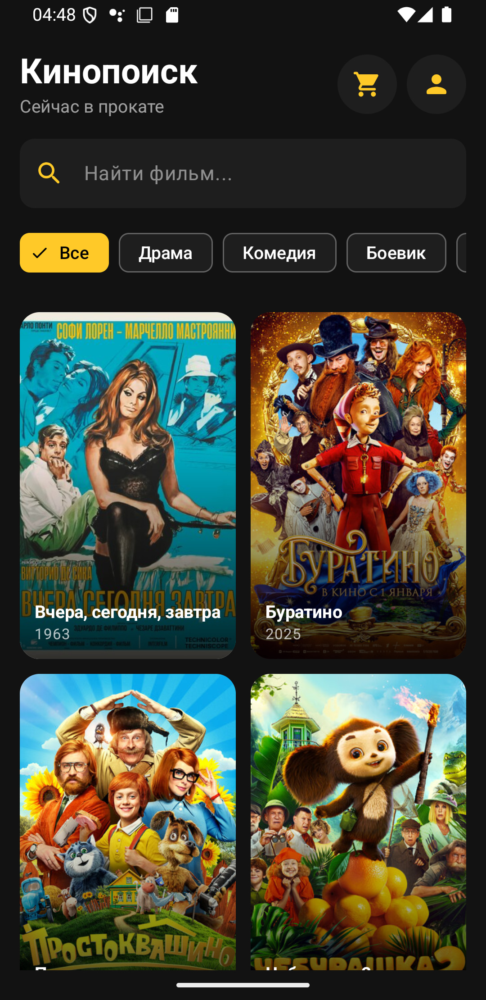
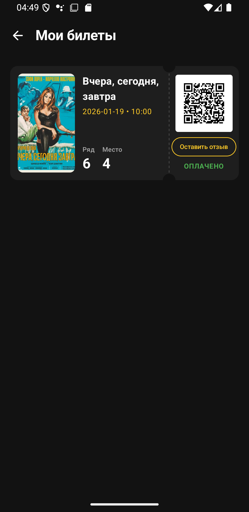

# 🎬 Кино онлайн

Мобильное приложение для просмотра афиши кинотеатра, выбора мест и покупки билетов. Проект разработан в рамках дипломной работы с использованием современного стека Android-разработки.


## ✨ Функционал

* **Афиша:** Просмотр списка текущих и будущих фильмов.
* **Детали фильма:** Описание, рейтинг, актеры и трейлеры.
* **Бронирование:** Интерактивная схема зала с выбором мест.
* **Личный кабинет:** Просмотр истории покупок и активных билетов.
* **Авторизация:** Вход и регистрация пользователей.
* **Рецензии:** Просмотр и публикация рецензий к фильму.
* **Геймификация:** Возможность получения достижений за достижение определенных показателей.
* **Система лояльности:** Возможность получать баллы и снижать стоимость билета за них.

## 📱 Скриншоты

| Главный экран | Выбор мест | Билет | Профиль |
|:---:|:---:|:---:|:---:|
|  |  |  |  |
## 🛠 Технологический стек

Проект построен на архитектуре **MVVM** с принципами **Clean Architecture**.

* **Язык:** [Kotlin](https://kotlinlang.org/)
* **UI:** [Jetpack Compose](https://developer.android.com/jetbrains/compose) (Material Design 3)
* **Навигация:** Navigation Compose
* **Асинхронность:** Coroutines + Flow
* **DI (Внедрение зависимостей):** Hilt *[выбери нужное]*
* **Сеть:** Retrofit + OkHttp
* **Загрузка изображений:** Coil
* **База данных :** Room (для кэширования)

## 🚀 Установка и запуск

Для запуска проекта вам понадобится Android Studio Ladybug или новее.

1.  Клонируйте репозиторий:
    ```bash
    git clone https://github.com/xckrt/kino.git
    ```
2.  Откройте проект в Android Studio.
3.  Дождитесь синхронизации Gradle.
4.  Запустите на эмуляторе или реальном устройстве.

## 📂 Структура проекта

```text
com.example.cinemaapp
├── data                     # Реализация репозиториев, API, БД
├── components               # компоненты UI
├── dialogs                  # Диалоги для взаимодействия
├── utils                    # Бизнес-логика
├── viewmodel                # Viewmodel
├── screens 
│   ├── LoginScreen          # Экран авторизации
│   ├── HomeScreen           # Главный экран
│   ├── BookingScreen        # Выбор мест
│   ├── ProfileScreen        # Профиль пользователя
│   ├── MovieDetailsScreen   # Экран фильма
│   ├── TicketsScreen        # Экран оформленных билетов
│   ├── RegisterScreen       # Экран регистрации
│   └── CinemaApp            # Навигационный раздел
├── ui.theme                 # Тема приложения, цвета, шрифты
├── KinoApp                  # Hilt класс
└── MainActivity             
